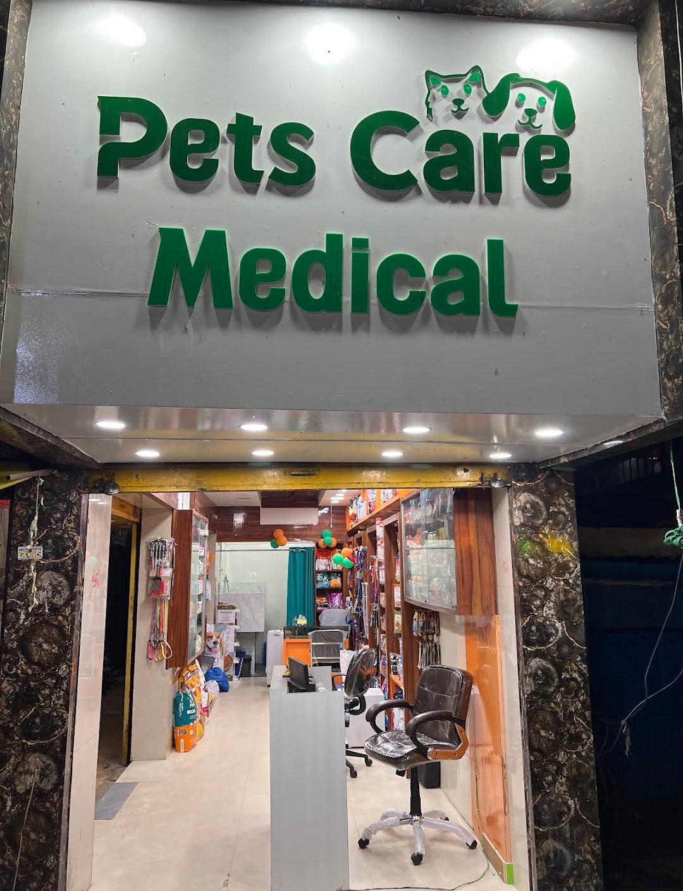

# Pets Care Medical — Premier Veterinary & Pet Care Platform

A premium, modern, mobile-first website for **Pets Care Medical**, Lalpur, Ranchi. Built with a healthcare-grade luxury aesthetic combining 24/7 veterinary surgery, professional pet grooming spa, and comprehensive pet store.



---

## 📍 Business Overview

- **Business Name:** Pets Care Medical
- **Category:** Veterinary Care + Pet Grooming + Pet Store & Pharmacy
- **Address:** Hazaribagh Road, Opposite Shreelather, Lalpur, Ranchi, Jharkhand 834001
- **Phone:** `082525 44441` (24/7 Hotline)
- **Google Rating:** 4.9 ⭐ (97+ Reviews)
- **Operating Hours:** Open 24 Hours, 7 Days a Week
- **Google Maps Plus Code:** `98CM+H2 Ranchi, Jharkhand`

---

## 🌟 Architecture & Dedicated Pages

The website features a dedicated multi-page architecture with synchronized single-line navigation, responsive mobile drawer, and interactive modals:

| Page | File | Description |
| :--- | :--- | :--- |
| **Home** | `index.html` | High-converting portal with curated 6-photo real gallery preview & department overviews |
| **Veterinary Care** | `veterinary.html` | 24/7 emergency surgery, sterile operating suite, post-op ICU, avian & exotic medicine |
| **Pet Grooming** | `grooming.html` | Built-in marble hydrobath, 3 signature grooming packages, breed-specific scissor styling |
| **Pet Store** | `store.html` | Prescription clinical diets, licensed 24/7 pharmacy, accessories & WhatsApp delivery |
| **Real Gallery** | `gallery.html` | 35 authentic in-clinic photos, Instagram story highlights, category tabs & lightbox |
| **About Us** | `about.html` | Clinic story, 4 core medical pillars, 4.9-star review wall, and facility tour |
| **Contact & Directions** | `contact.html` | Interactive WhatsApp inquiry form, 24/7 hotline, landmark directions & Google Map |

---

## 🛠️ Technology Stack

- **HTML5 & CSS3**: Vanilla, modular CSS with CSS variables (`--color-primary`, `--color-accent`, etc.), clamp typography, and zero heavy dependencies.
- **Modern JavaScript**: Zero external frameworks; clean vanilla ES6 for lightbox zoom, interactive appointment booking, FAQ accordions, and WhatsApp integration.
- **Pure Vector SVGs**: High-definition, bulletproof inline SVG icons for all departments and stat cards.
- **SEO & Structured Data**: Comprehensive Schema.org `VeterinaryCare`, `PetStore`, `ImageGallery`, and `LocalBusiness` JSON-LD schemas.
- **Accessibility & Mobile-First**: Skip-to-content links, ARIA labels, semantic landmark elements, and mobile-friendly tap targets.

---

## 🚀 Local Development

Open `index.html` in any modern web browser or start a local server:

```powershell
# Using PowerShell local server
powershell -ExecutionPolicy Bypass -File server.ps1

# Or with Python
python -m http.server 5000

# Or with Node.js
npx serve
```

Visit `http://localhost:5000/`.

---

## 📄 License & Attribution

Copyright © 2026 Pets Care Medical. All rights reserved.
Developed for Pets Care Medical, Lalpur, Ranchi, Jharkhand.
